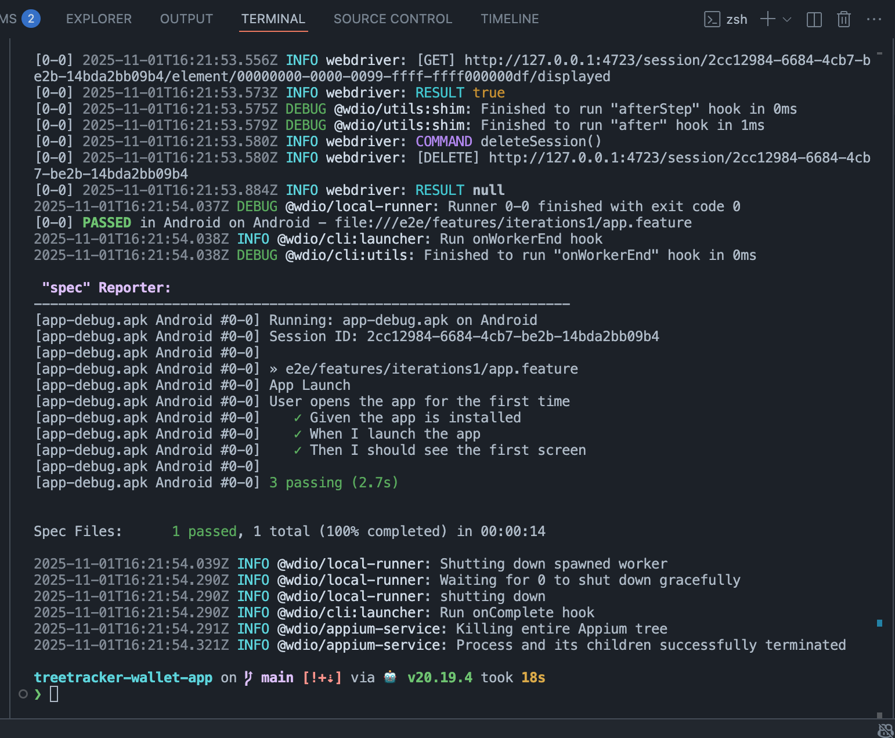

# 🚀 E2E Testing with Appium, WebdriverIO & Cucumber

This guide explains how to set up and run E2E tests for the native app using
Appium, WebdriverIO, and Cucumber (Gherkin) in a monorepo project.

## ⚡ Quick Commands

| Step                        | Command                 |
| --------------------------- | ----------------------- |
| Install dependencies        | `yarn install`          |
| Install Appium globally     | `npm install -g appium` |
| Start Appium server         | `appium`                |
| Start Expo                  | `yarn native:start`     |
| Build & install Android app | `yarn native:android`   |
| Build & install iOS app     | `yarn native:ios`       |
| Run WebdriverIO tests       | `yarn native:bdd:test ` |

## 🧱 1. Install Dependencies

```bash
yarn install       # Run at root level of the project

npm install -g appium

appium -v # Confirm Appium is running version 3

```

```bash
# Run `appium driver list` to verify if the drivers uiautomator2 (Android) and
# xcuitest (iOS) are installed. If they’re not installed, install them using:

 appium driver install uiautomator2
 appium driver install xcuitest
```

## 🤖 2. Start Appium Server

```bash
appium   # Run at root level of the project
```

## 📱 3. Build & Install Native App

To build both the Android and iOS apps:

```bash
yarn prebuild  # Run at root level of the project
```

**Android:** To create the apk file:

```bash
yarn build-apk-android   # Run at root level of the project
```

and run:

```bash
yarn native:start  #  Run at root level of the project
```



**iOS:** 🚧 In progress

```bash
yarn native:ios
```

## 🧪 4. Run WebdriverIO E2E Tests

```bash
yarn native:bdd:test  # From root level
```

## 🔧 5. Appium Inspector Setup

##### Method 1: Web-based Inspector

Go to https://inspector.appiumpro.com/ Start Appium server: npx appium
--base-path / --port 4724 Configure connection: Remote Path: / Host: 127.0.0.1
Port: 4724

##### Method 2: Desktop App

Download from: https://github.com/appium/appium-inspector/releases

## ⚙️ 6. Capabilities

**iOS:** 🚧 In progress

```json
{
  // platformName: "iOS",
  // appium:deviceName: "iPhone 16",
  // appium:platformVersion: "18.5",
  // appium:automationName: "XCUITest",
  // appium:app: "com.gsw.app",
  // appium:autoGrantPermissions: true,
  // appium:noReset: true
}
```

**Android:**

```json
{
  "platformName": "Android",
  "appium:deviceName": "Pixel_9a", // Make sure this matches the name of your Android emulator
  "appium:app": "${process.env.PROJECT_ROOT}/android/app/build/outputs/apk/debug/app-debug.apk",
  "appium:automationName": "UiAutomator2",
  "appium:appPackage": "com.gtw.app",
  "appium:appActivity": "com.gtw.app.MainActivity",
  "appium:noReset": false,
  "appium:newCommandTimeout": 240,
  "appium:appWaitPackage": "*",
  "appium:debugLogLevel": "debug",
  "appium:appWaitForLaunch": false
}
```

💡 PROJECT_ROOT = absolute path to your project root. Examples: macOS/Linux:
/Users/user/dev/treetracker-wallet-app, Windows:
C:\\Users\\user\\dev\\treetracker-wallet-app

## 7. 📚 Additional Resource

- [Appium Documentation](https://appium.io/docs/en/latest/)
- [WebdriverIO Appium Service](https://webdriver.io/docs/appium-service/)
- [Cucumber with WebdriverIO](https://webdriver.io/docs/cucumber-framework/)
- [Appium Inspector](https://github.com/appium/appium-inspector)
- [Expo Dev Client](https://docs.expo.dev/clients/introduction/)

## 8. ⚠️ Troubleshooting

- Start the Expo app using:

  ```bash
  yarn native:start
  ```

- Make sure the Appium Dev Server is running before starting the tests.

- Rebuild the project after making any code changes.

- Verify that the correct device or emulator is selected and running.

- Check the Appium server logs for connection issues or errors.

- Ensure the app is installed on the device or emulator before running tests.

- If tests fail to locate elements, double-check the selectors used in your test
  scripts.
- Verify that PROJECT_ROOT is set correctly.
- Make sure appium:deviceName matches the name of your Android or iOS emulator
