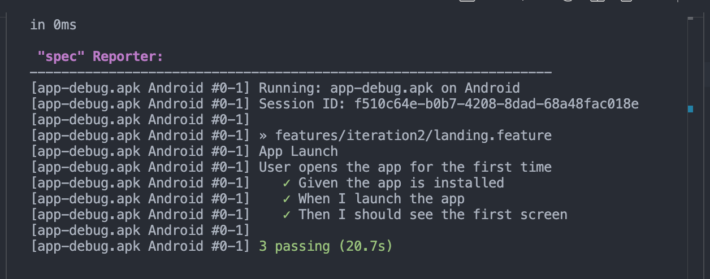
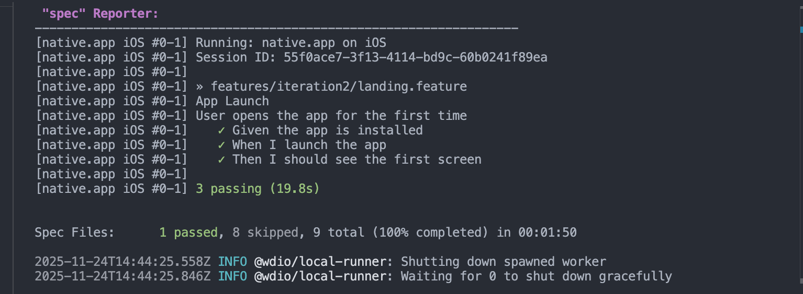

# BDD Tests in React Native

This guide walks you through setting up and running BDD tests in a React Native project using Appium for both Android and iOS.

---

### Install Appium globally

```bash
npm install -g appium (v3) # Ensure Appium is version 3.x
```

Run `appium driver list` to verify if the drivers uiautomator2 (Android) and
xcuitest (iOS) are installed.
See: https://appium.io/docs/en/latest/

### Match your device names

located(`bdd/utils/capabilities`)

- **Android:** The `deviceName` in your capabilities must match your Android Emulator name.
- **iOS:** The `deviceName` must match your iOS Simulator name exactly.

If these names don’t match, Appium will fail to launch the app.

---

## 1. Generate Native Folders

From the project root:

```bash
yarn prebuild
```

These folders are required before you can build or install your native apps.

---

# 2. Android: Build, Install, and Run Tests

### Build the Android app

From the project root:

```bash
yarn build-apk-android
```

### Install the app on the Android emulator

From the project root:

```bash
yarn native:android
```

Wait for installation to complete, then stop the process.

## Configure App Paths

```bash
cd apps/native
```

Get the absolute path:

```bash
pwd
```

Copy this path and place it in your `.env` under the key `PROJECT_ROOT_ANDROID` (located in `bdd/.env`).

### Start the Appium server

From the project root:

```bash
appium
```

### Start Metro and launch the Android app

From the project root:

```bash
yarn native:start
```

Press `a` to open the Android app in the emulator.

### Run Android BDD tests

From the project root:

```bash
yarn bdd:test:android
```



---

## 3. iOS: Build, Install, and Run Tests

### Install CocoaPods

Inside the `ios` directory:

```bash
pod install
```

### Build the iOS app

From the project root:

```bash
yarn build-app-ios
```

**Alternative:** Build manually with Xcode:

```bash
xcodebuild -workspace native/ios/native.xcworkspace \
  -scheme native \
  -sdk iphonesimulator \
  -configuration Debug \
  -destination 'platform=iOS Simulator,name=iPhone 17 Pro,OS=latest'
```

> Ensure the simulator name and OS version exactly match your local setup.
>
> See:https://developer.apple.com/documentation/xcode/building-and-running-an-app

---

### Install the app on the Ios emulator

From the project root:

```bash
yarn native:ios
```

iOS – Set `PROJECT_ROOT_IOS`

Once Xcode installs the app, it prints the installation path in the terminal.

Copy that path and add it as `PROJECT_ROOT_IOS` (located in `bdd/.env`).

Wait for installation to complete, then stop the process.

---

#### Start Metro:

From the project root:

```bash
yarn native:start
```

Press `i` to launch the app in the iOS simulator.

### Ensure Appium is running

```bash
appium
```

### Run iOS BDD tests

From the project root:

```bash
yarn bdd:test:ios
```


